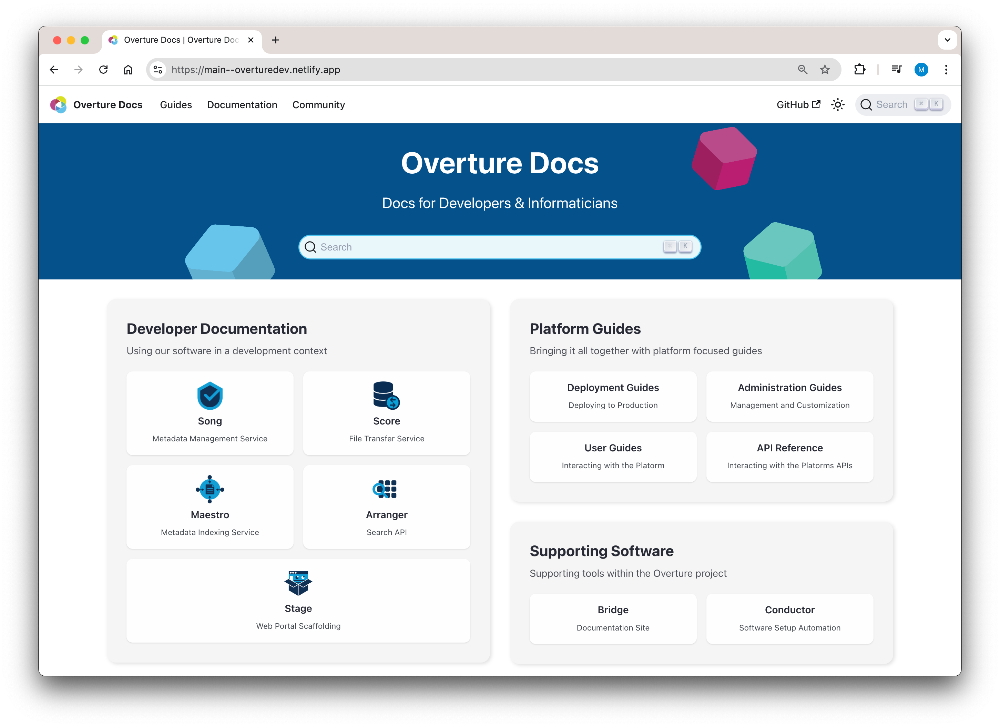

# Bridge

Proof of concept work for a developer hub using submodules from external repos to render a unified documentation site using the markdown files pulled from each submodule. 

The developer hub website is built using [Docusaurus](https://docusaurus.io/), a modern static website generator.



## Getting Started

To clone the repository with the files in the submodules:

```bash
git clone --recurse-submodules https://github.com/MitchellShiell/bridge.git
```

After cloning, you may wish to fetch and update the submodules:

```bash
git fetch --recurse-submodules
```

To fire up the local development server first install all the required dependencies

```
npm ci
```

Then run the following command: 

```
yarn start
```

Most changes are reflected live without having to restart the server.

> [!IMPORTANT]  
> Docusaurus requires node version 18 or higher

# Using submodules

### Fetching Latest Changes

To fetch the latest changes for all submodules:

```bash
git fetch --recurse-submodules
```

### Adding New submodules

You can add new submodules by either updating the .gitmodules folder or running the following command:

```bash
git submodule add <GitHub web URL> moduleB
```

To pull the latest changes for all submodules, including any new ones:

```bash
git submodule update --recursive --remote
```

### Updating submodule repos remotely

By `cd`ing into any of the submodules you are effectively working within the submodule repo as you would if you cloned the repo independently, all git branching, adding, and pushing will push to the external repo. Conversly the root directory will be working within the root project, in this case the bridge repo.

# Docusaurus

### Installation

```
$ yarn
```

### Local Development

```
$ yarn start
```

This command starts a local development server and opens up a browser window. Most changes are reflected live without having to restart the server.
