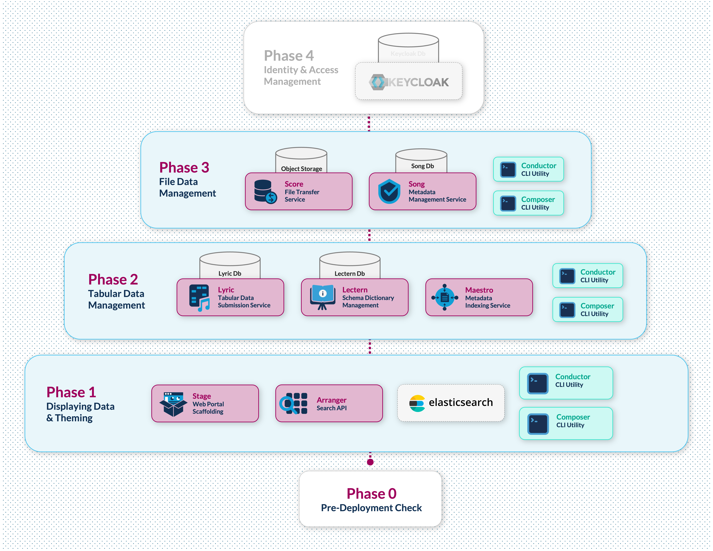

# Prelude

**Prelude** is a toolkit designed for the **planning and development stages** of Overture data platform implementation. It helps teams incrementally build and validate platform requirements, enabling them to:

-   Systematically verify requirements
-   Minimize technical overhead
-   Build a foundation for production deployment

:::important
Prelude is **not intended for production environments**. It serves as a preparatory tool to ensure successful production deployments. We will be actively improving resources to support teams transitioning from Prelude to production.
:::

We welcome feedback and suggestions—please share them via our [ideas forum](https://github.com/overture-stack/docs/discussions/categories/ideas).

## Development Phases

Prelude is structured into four incremental phases:



| **Phase**                               | **Focus**                                           | **Components/Tools**                            |
| --------------------------------------- | --------------------------------------------------- | ----------------------------------------------- |
| **Phase 0:** Pre-Deployment Check       | Making sure you have all the required prerequisites | Docker, appropriate resources for docker & Node |
| **Phase 1:** Data Exploration & Theming | Data visualization in the portal                    | Elasticsearch, Arranger, Stage                  |
| **Phase 2:** Tabular Data Management    | Backend data storage and validation                 | Lyric, Lectern, Postgres, MongoDB               |
| **Phase 3:** File Management            | File storage and metadata tracking                  | Song, Score, Object Storage                     |
| **_Phase 4:_** Identity & Access        | Security and user management                        | Keycloak integration                            |

**Phase 4** is not included in Prelude v1 and will be included in a future release.

## Supplemental Tools

### Composer

Transforms your data (CSV or JSON) into base Overture configurations including Elasticsearch Mappings, Arranger UI Configs, Lectern Dictionary and Schema, Song Schema. This utility greatly reduces tedious manual configurations.

Depending on the command Composer can input CSV or JSON file(s) that represent your data and output the following:

| Output                            | Purpose                                                              |
| --------------------------------- | -------------------------------------------------------------------- |
| **Elasticsearch Mappings**        | Defines the structure and indexing settings for your data            |
| **Arranger UI Configs**           | Configures the user interface for data exploration and visualization |
| **Lectern Dictionary and Schema** | Creates data dictionaries and schemas for tabular data               |
| **Song Schema**                   | Generates schema configurations for file metadata                    |

### Conductor

Conductor runs the automated deployments from the `/apps/conductor/scripts` directory. It can also be run as a command line client made to streamline interactions with various Overture API endpoints.

As summary of command line client interactions is provided in the table below:

| Feature                      | Description                                                                                                |
| ---------------------------- | ---------------------------------------------------------------------------------------------------------- |
| **CSV to Elasticsearch ETL** | Validate, transform and load CSV data to a specified elasticsearch index.                                  |
| **Configuration Management** | Submit dictionaries to Lectern, Register Lectern dictionaries with Lyric, Update Song Schema and study Ids |
| **Data Management**          | Upload tabular data to Lyric, Upload and publish file data and metadata.                                   |

### Additional Information

-   Relevant API swagger docs can be found from the API dropdown. These swagger APIs are only available when running phases that include the respective service

## Getting Started

_If you’re reading from the Prelude documentation page, this section may be redundant._

### 1. Clone the repository

```sh
git clone https://github.com/overture-stack/prelude.git
cd conductor
```

### 2. Pre-deployment Check

Run a pre-deployment check:

```sh
make phase0
```

**Requirements:**

-   **Docker Desktop 4.39.0+** with:
    -   8-core CPU minimum
    -   8 GB memory
    -   2 GB swap
    -   64 GB virtual disk
-   **Node.js 18+ and npm 9+**

### 3. Build the local Stage UI image

```sh
cd apps/stage
docker build --platform linux/arm64 -t stageimage:1.0 .
```

### 4. Deploy Phase 1

Run from the root directory:

```sh
make phase1
```

### 5. Access the Portal

Once running, access the portal at: [http://localhost:3000](http://localhost:3000).

All Prelude documentation is available in the **Documentation** tab here or on our [documentation site](https://docs.overture.bio/other-software/prelude).

## Support

For assistance, reach out via our [community support channels](https://docs.overture.bio/community/support):

-   **Public support:** Use GitHub issues
-   **Private inquiries:** Contact us via OICR Slack or [contact@overture.bio](mailto:contact@overture.bio)

We’re actively working on resources to help teams transition to production. If you have suggestions, post them on our [GitHub discussion forum](https://github.com/overture-stack/docs/discussions/categories/ideas).
