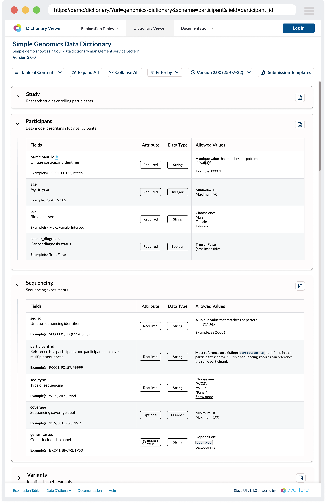
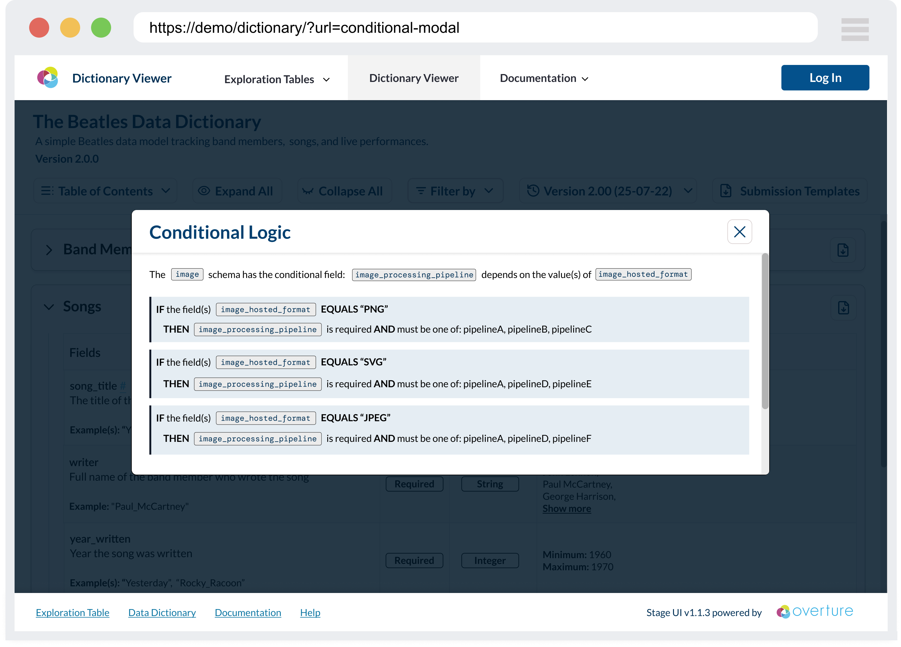
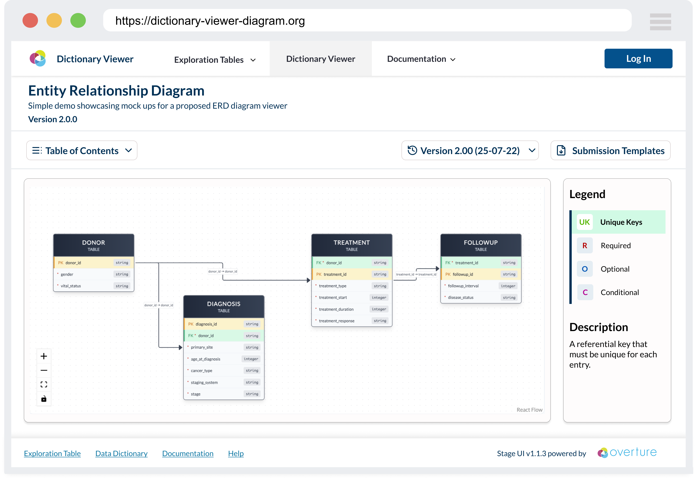
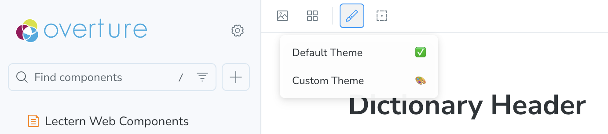

# Lectern Viewer

The Lectern data dictionary viewer is a React-based component library that will provide user interfaces for viewing and interacting with Lectern data dictionaries. It aims to transform technical JSON schema specifications into accessible, organized displays that make data models and data requirements clear and understandable for researchers and data submitters.

The Lectern UI is being developed as a standalone component library that can be integrated into any data platform to provide dictionary viewing capabilities. It will consume [Lectern dictionary schemas](../01-core-software/00-Lectern/03-dictionaryReference.md) and render them through two primary interface modes: tabular views for detailed field-by-field exploration and a diagram view for visualizing schema relationships.

The viewer serves as the presentation layer in the data submission workflow, providing researchers with clear visualization of data requirements before they begin the submission process through integrated platforms.

The viewer is being developed initially to serve the [Pan-Canadian Genome Library (PCGL)](https://genomelibrary.ca/), a national initiative that will integrate the viewer for communicating data requirements to researchers across Canada's genomics community. The PCGL implementation will serve as a reference for how other research platforms can integrate the viewer components.

## Field Viewer



The tabular view provides comprehensive field-by-field documentation with expandable sections for detailed validation rules, examples, and metadata. Interactive elements allow users to filter, search, and navigate through complex schema definitions efficiently.

**Key Features:**

- **Interactive Schema Tables:** Detailed tabular views showing field definitions, data types, validation rules, and examples with expandable sections for complex restrictions
- **Version Management:** Built-in support for switching between different dictionary versions with change tracking and comparison capabilities
- **Template Downloads:** Generate CSV templates based on schema definitions to streamline data submission workflows
- **Responsive Design:** Modern, accessible interface that works across desktop and mobile devices with support for custom theming

### Conditional Logic Modal



Complex conditional validation rules are presented through modal overlays that break down if-then-else logic into digestible, structured displays that clearly communicate field dependencies and requirements.

**Key Features:**

- **Conditional Logic Visualization:** Clear presentation of complex conditional validation rules through modal overlays and structured displays

## Entity Relationship Viewer



The diagram view visualizes schema relationships using interactive flowcharts that demonstrate how different schemas connect through primary and foreign key relationships, helping users understand the overall data model structure.

**Key Features:**

- **Entity Relationship Diagrams:** Visual representations of schema relationships using interactive flowcharts that show primary and foreign key connections
- **Component-Driven Architecture:** Built with Storybook for isolated development, testing, and documentation of reusable components

## Integration Points

As part of the larger Overture ecosystem, the Lectern UI will be used with additional integrations, including:

- **Lectern Server:** The REST API service that manages and serves dictionary schemas, providing version control and validation
- **Lyric:** Overture's tabular data submission service that uses Lectern schemas for data validation and quality assurance

## Development Approach

The Lectern UI is built using **component-driven development** with [Storybook](https://storybook.js.org/) as the primary development environment. This approach enables:

- **Isolated Component Development:** Each UI component is developed and tested in isolation, ensuring reliability and reusability
- **Interactive Documentation:** Living documentation that serves both developers and stakeholders with real examples and use cases
- **Design System Integration:** Consistent theming and styling across all components with easy theme switching and testing
- **Collaborative Development:** Non-technical stakeholders can review and provide feedback on components before integration

## Developer Quick Start

The codebase leverages [Storybook](https://storybook.js.org/) as the primary development environment for building, testing, and documenting components. This component-driven development approach ensures each piece of the UI is developed in isolation and thoroughly tested before integration.

To run Storybook:

1. Install all dependencies:

```sh
pnpm install
```

2. Run Storybook:

```sh
pnpm storybook
```

Storybook will run on port 6006 by default: [http://localhost:6006/](http://localhost:6006/)

:::tip Why Storybook?
Storybook enables rapid development and testing of UI components in isolation, provides living documentation for the design system, and facilitates collaboration between developers, designers, and stakeholders by offering a visual interface for component exploration.
:::

## Editing Stories

All stories are located within the `/stories` directory.

### Theme Decorator

All Lectern Components rely on the `LecternThemeProvider`. If this provider is not present, they will render using the default `LecternTheme`.

In order to help testing Lectern-UI Components with alternate themes, a `themeDecorator` is provided to be used in stories. The `themeDecorator` can be added to any component story as follows:

```ts
import themeDecorator from "../themeDecorator"; // import from stories/themeDecorator.tsx

const meta = {
  component: MyComponent,
  title: "Category Name/My Component",
  tags: ["autodocs"],
  // INCLUDE THE DECORATOR HERE:
  decorators: [themeDecorator()],
} satisfies Meta<typeof MyComponent>;
```

To help with testing, a global property named `theme` has been set, and a selector has been added to the Storybook Toolbar:



The theme selected from the toolbar theme selection tool will be applied to all stories with the `themeDecorator`.

At the moment there is only one alternate theme provided. It is defined inside the `themeDecorator` file - to test alternate stylings please update this custom theme.

#### Adding Additional Themes

To add additional themes in the drop down for the `themeDecorator` to use, you must add an option for the storybook `globalType.theme` property. This is done in the `/storybook/preview.ts`) file:

```ts
const preview: Preview = {
  globalTypes: {
    theme: {
      description:
        "Display theme used for all components with the themeDecorator.",
      toolbar: {
        icon: "paintbrush",
        items: [
          { value: "default", right: "✅", title: "Default Theme" },
          { value: "custom", right: "🎨", title: "Custom Theme" },
          {
            value: "newTheme",
            right: "{choose an emoji}",
            title: "Your New Theme",
          },
        ],
      },
    },
  },
  // ...
};
```

Now that we have an additional option, the `themeDecorator` must be provided the specified theme. The logic for providing the selected theme to the decorator is handled in the `themeDecorator` file in the function `function getGlobalTheme(globalTheme: string)`. Add a new case for the `globalType.theme` value that you added to `./storybook/preview.ts`.

```ts
function getGlobalTheme(globalTheme: string): PartialTheme {
  switch (globalTheme) {
    case "custom": {
      return customTheme;
    }
    case "newTheme": {
      // Return your new theme
      return {};
    }
    default: {
      return {};
    }
  }
}
```

:::note Development Status
The Lectern UI is currently in active development. Features and interfaces are subject to change as we iterate based on community feedback and user testing with research platforms like the Pan-Canadian Genome Library (PCGL).
:::
