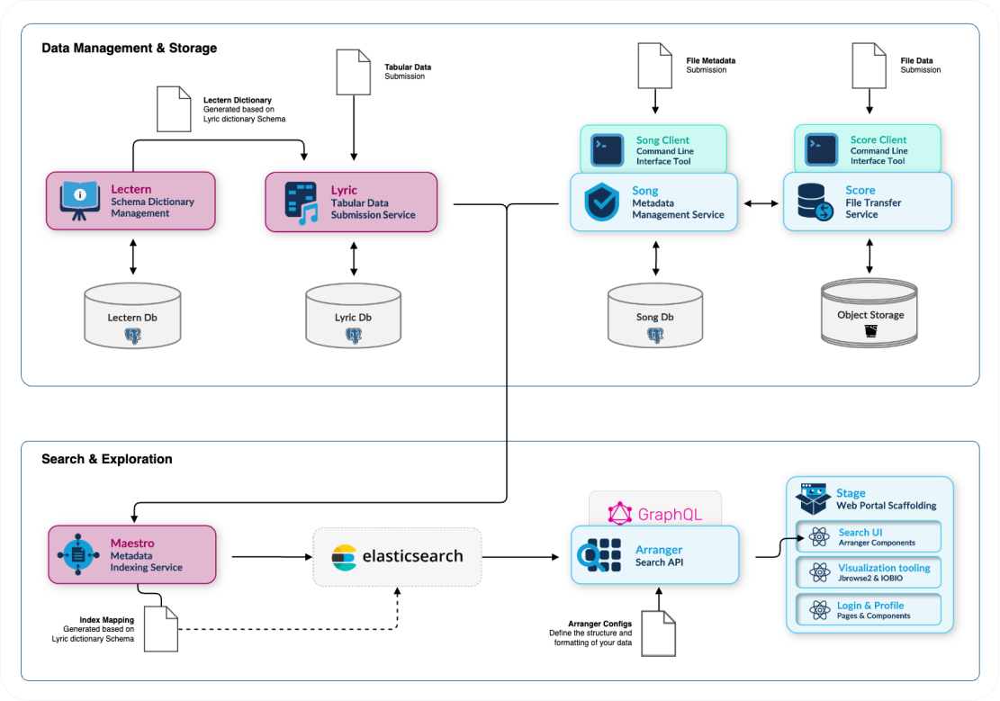

# Under Development

As part of our work on the [Pan-Canadian Genome Library](https://oicr.on.ca/first-ever-national-library-of-genomic-data-will-help-personalize-cancer-treatment-in-canada-and-around-the-world/) we are currently developing a **new data submission system** to better
support tabular (clinical) data.

This new system will see two new components integrated into the Overture Platform:

- [**Lectern**](https://docs.overtue.bio/docs/core-software/lectern/overview): A version-controlled Data Dictionary Schema Manager that defines, validates, and manages schemas used for data submissions, supporting data integrity across evolving data management systems.
- [**Lyric**](https://docs.overture.bio/docs/development/lyric/): Validate, store, query, and re-validate tabular data against evolving Lectern Dictionary schemas.

Additionally, we are updating our indexing service:

    - [**Maestro v5**](https://github.com/overture-stack/maestro/tree/M5) will see multiple updates including the ability to index data from Song and Lyric into one elasticsearch index.

Combined together the new Overture Platfrom architecture will look as follows:

We have also began development on a series of user interfaces to help communicate data in human readable formats:

- [Lectern UI](./02-lecternViewer.md)
- Arranger Charts
