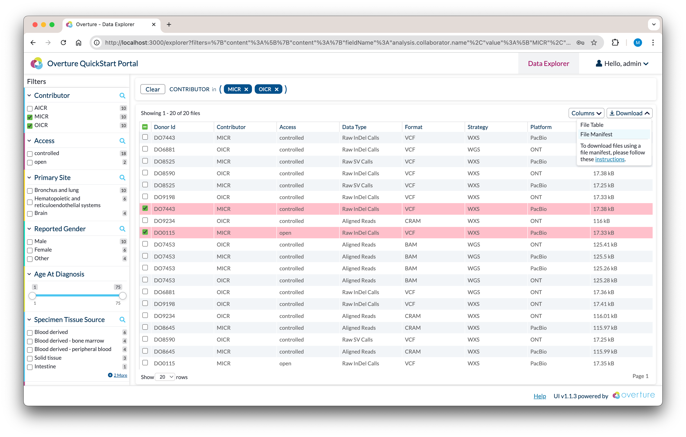

# File Download

**This guide is for** anyone seeking guidance on how to download data from an Overture platform.

**You will need** Docker installed. We recommend using Docker Desktop; for more information, visit [Docker's website](https://www.docker.com/products/docker-desktop/).

#### Visual Summary:


## Getting Started

This guide uses a dedicated demo environment: the `docs-demo/file-transfer` branch of the Overture Prelude repository. It is a self-contained Overture portal (Song, Score, Maestro, MinIO, Arranger, and Stage).

**1. Clone the demo branch**

```bash
git clone -b docs-demo/file-transfer https://github.com/overture-stack/prelude.git
cd prelude
```

**2. Start the platform with sample data**

```bash
make demo
```

:::caution
**Ensure enough resources are allocated to Docker.** We recommend a minimum CPU limit of `8`, memory limit of `8 GB`, swap of `2 GB`, and virtual disk limit of `64 GB`. You can access these settings by selecting the **cog wheel** at the top right of the Docker Desktop app and selecting **Resources** from the left panel. **Ensure you are on Docker Desktop version 4.39.0 or higher.**
:::

`make demo` starts the stack and loads the sample dataset (3 donors, 12 files). Once indexing completes, the portal at `localhost:3000` shows 12 records ready to download. If you already started the platform with `make platform`, run `make submit` to load the sample data.

## Data Download with the Score Client

### Generate a Manifest

1. **Build your query:** Open the portal's file repository at `localhost:3000/fileTable` and use the search facets and data table to narrow your selection. The file count updates in real time.



2. **Download your manifest:** With your data of interest selected, click the **Download** dropdown and select **File Manifest**.

:::info
**Why a manifest?**

The file manifest is a tab-separated (TSV) list of the files matching your query. Score uses it to locate and download your data efficiently. We use manifests with a dedicated file-transfer service because large genomic datasets require reliable multi-part download sessions, which are not suitable for browser-based transfers.
:::

### Run the Score Client

Authentication is disabled in this demo, so a fixed placeholder access token is used. The client runs as a Docker container joined to the platform's internal network (`overture-demo_platform-network`) so it can reach Song and Score by hostname.

```bash
docker run -d -it --name score-client \
    -e ACCESSTOKEN=68fb42b4-f1ed-4e8c-beab-3724b99fe528 \
    -e STORAGE_URL=http://score:8087 \
    -e METADATA_URL=http://song:8080 \
    --network overture-demo_platform-network \
    --platform linux/amd64 \
    --mount type=bind,source="$(pwd)/data",target=/data \
    ghcr.io/overture-stack/score-client:ee758b91
```

<details>

  <summary><b>Click here for a detailed breakdown</b></summary>

- `-d` runs the container in detached mode, so it runs in the background

- `-it` combines `-i` (interactive) and `-t` (allocate a pseudo-TTY), allowing you to interact with the container

- `-e ACCESSTOKEN=...` supplies the access token. Auth is disabled in this demo, so the value is accepted without being checked

- `-e STORAGE_URL=http://score:8087` is the Score server the client interacts with, reachable by hostname on the platform network

- `-e METADATA_URL=http://song:8080` is the Song server the client interacts with

- `--network overture-demo_platform-network` joins the container to the platform's internal network so `song` and `score` resolve

- `--platform linux/amd64` selects the image architecture

- `--mount type=bind,source="$(pwd)/data",target=/data` mounts the local `data/` directory into the container. Downloaded files and the manifest are shared through this directory

</details>

### Download your Data

Place the manifest downloaded from the portal into the `data/` directory of the cloned repository. For simplicity, rename it to `manifest.tsv`. Then run:

```bash
docker exec score-client sh -c "score-client download --manifest /data/manifest.tsv --output-dir /data/downloads"
```

- `--manifest /data/manifest.tsv` points at the manifest you downloaded from the portal

- `--output-dir /data/downloads` is where the files are written

If successful, the Score client produces logs like the following, and your files are written to `./data/downloads/`:

```bash
Downloading...
---------------------------------------------------------------------------------------------------------------------------------------------------------------
[1/2] Downloading object: 5b3bf92a-8f57-54b9-9ab9-6dcf34a0dc78 (DO001.snv.vcf.gz)
---------------------------------------------------------------------------------------------------------------------------------------------------------------
100% [#########################]  Parts: 1/1, Checksum: 100%, Write/sec: 177.7K/s, Read/sec: 177.7K/s
Finalizing...
Total execution time:        122.6 ms
Total bytes read    :          17,346
Total bytes written :          17,346
Verifying checksum...Done.
```

### Clean up

Remove the client container when finished:

```bash
docker rm -f score-client
```

## Exporting Search Results (No Download)

To export the filtered table as a spreadsheet without downloading files:

1. Apply your filters in the portal
2. Click **Download**, then **File Table**

This downloads a TSV with the rows for all matching records. No Score client or manifest is needed.

:::tip
**Help us make our guides better**
If you can't find what you're looking for please don't hesitate to reach out through our [**support page**](/community/support) or our [**discussion forum**](https://github.com/overture-stack/docs/discussions?discussions_q=).
:::
