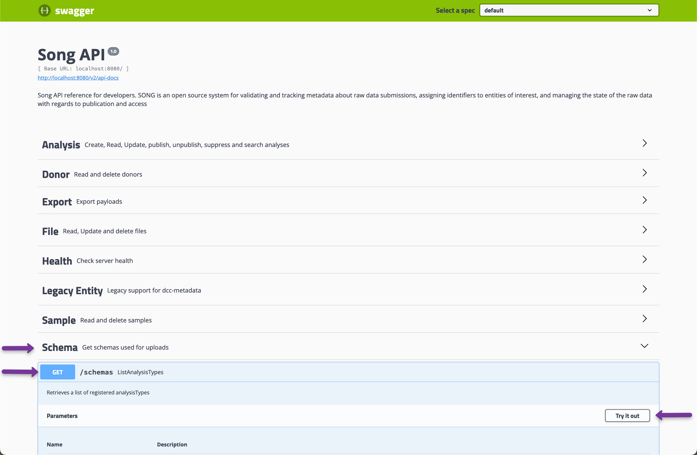
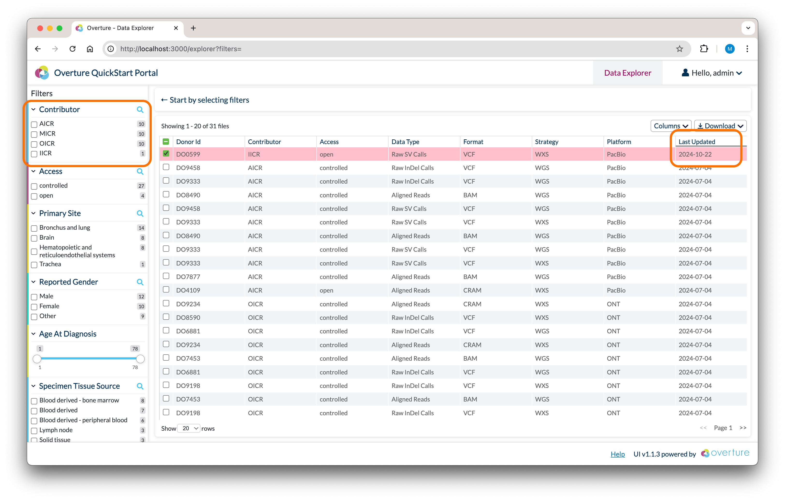

# File Submission

**This guide is for** anyone seeking guidance on submitting data to an Overture platform. By the end of this guide you will have completed a full data submission workflow: registering an analysis with Song and uploading its files with Score.

**You will need** Docker installed. We recommend using Docker Desktop; for more information, visit [Docker's website](https://www.docker.com/products/docker-desktop/).

**Background:** Submitting data to an Overture platform typically means data files (BAMs, CRAMs, VCFs, and similar) together with associated metadata that provides context, including donor information and descriptions of the data files. This guide focuses on submitting data to Song and Score using their command-line clients (CLIs).

#### Visual Summary:


## Prerequisites

Install and verify the following before you start.

<details>
<summary><strong>1. WSL2 Setup </strong>(windows only)</summary>

Docker Desktop on Windows runs on WSL2, so configure it before installing Docker Desktop below:

1. Install [WSL2](https://learn.microsoft.com/en-us/windows/wsl/install)
2. Use Ubuntu or another Linux distribution within WSL2
3. Enable Docker Desktop's WSL2 integration (Docker Desktop → Settings → Resources → WSL Integration)
4. Run all commands from a **Bash terminal inside WSL2**, not PowerShell or Command Prompt. To open one, search for your Linux distribution (e.g. "Ubuntu") in the Start menu.

</details>

<details>
<summary><strong>2. Git</strong> installed</summary>

Download from [git-scm.com](https://git-scm.com/downloads) if the command is not recognised.

</details>

<details>
<summary><strong>3. Docker Desktop</strong> (`28.0.0` or later)</summary>

- **macOS / Windows:** Download from [docker.com/products/docker-desktop](https://www.docker.com/products/docker-desktop/)
- **Linux:** Follow the [Docker Engine install guide](https://docs.docker.com/engine/install/)

Once installed, open Docker Desktop → Settings → Resources and set:

- **CPUs:** 4+ cores (8 recommended)
- **Memory:** 8 GB minimum
- **Disk:** 10 GB+ available

Please ensure `docker --version` and `docker compose version` both return version numbers, and Docker Desktop is **running** with **4+ CPUs** and **8 GB+ memory** allocated

</details>

## Getting Started

This guide uses a dedicated demo environment: the `docs-demo/file-transfer` branch of the Overture Prelude repository. It is a self-contained Overture portal (Song, Score, Maestro, MinIO, Arranger, and Stage) preconfigured with a `demo` study and a `genomicVariants` analysis schema.

**1. Clone the demo branch**

```bash
git clone -b docs-demo/file-transfer https://github.com/overture-stack/prelude.git
cd prelude
```

**2. Start the platform**

```bash
make platform
```

:::caution
**Ensure enough resources are allocated to Docker.** We recommend a minimum CPU limit of `8`, memory limit of `8 GB`, swap of `2 GB`, and virtual disk limit of `64 GB`. You can access these settings by selecting the **cog wheel** at the top right of the Docker Desktop app and selecting **Resources** from the left panel. **Ensure you are on Docker Desktop version 4.39.0 or higher.**
:::

`make platform` starts the stack empty so you can submit your own data. The setup step creates the `demo` study and registers the `genomicVariants` schema automatically.

## What are we submitting?

A **payload** is a JSON file describing an analysis: its clinical metadata and the list of files to upload. The demo ships three sample payloads in `data/payloads/` (`DO001.json`, `DO002.json`, `DO003.json`), each listing four small placeholder genomic files in `data/files/`.

Below is the payload for donor `DO001`. Its `analysisType` is `genomicVariants`, the schema registered during setup.

<details>
<summary><b>View the payload (DO001.json)</b></summary>

```json
{
  "studyId": "demo",
  "analysisType": { "name": "genomicVariants" },
  "samples": [
    {
      "submitterSampleId": "DO001-SA01",
      "matchedNormalSubmitterSampleId": null,
      "sampleType": "Total DNA",
      "specimen": {
        "submitterSpecimenId": "DO001-SP01",
        "tumourNormalDesignation": "Tumour",
        "specimenType": "Primary tumour",
        "specimenTissueSource": "Breast"
      },
      "donor": {
        "submitterDonorId": "DO001",
        "gender": "Female"
      }
    }
  ],
  "files": [
    {
      "fileName": "DO001.snv.vcf.gz",
      "fileSize": 0,
      "fileMd5sum": "00000000000000000000000000000000",
      "fileType": "VCF",
      "fileAccess": "open",
      "dataType": "SNV"
    },
    {
      "fileName": "DO001.indel.vcf.gz",
      "fileSize": 0,
      "fileMd5sum": "00000000000000000000000000000000",
      "fileType": "VCF",
      "fileAccess": "open",
      "dataType": "INDEL"
    },
    {
      "fileName": "DO001.cnv.txt.gz",
      "fileSize": 0,
      "fileMd5sum": "00000000000000000000000000000000",
      "fileType": "TXT",
      "fileAccess": "open",
      "dataType": "CNV"
    },
    {
      "fileName": "DO001.sv.vcf.gz",
      "fileSize": 0,
      "fileMd5sum": "00000000000000000000000000000000",
      "fileType": "VCF",
      "fileAccess": "open",
      "dataType": "SV"
    }
  ],
  "experiment": {
    "sex": "female",
    "age_at_diagnosis": 55,
    "vital_status": "alive",
    "diagnosis_date": "2021-03-15",
    "disease_stage": "Stage II",
    "primary_diagnosis": "Breast Adenocarcinoma",
    "treatment_type": "Surgery",
    "treatment_response": "Complete Response"
  }
}
```

</details>

:::info
`fileSize` and `fileMd5sum` are placeholders in the committed payloads. The Song and Score clients compute the real values from disk at submission time; the payload files themselves are never modified.
:::

## Run the Song and Score clients

The clients run as Docker containers joined to the platform's internal network (`overture-demo_platform-network`) so they can reach the services by hostname. Authentication is disabled in this demo, so a fixed placeholder access token is used throughout.

**1. Start the Song client**

```bash
docker run -d -it --name song-client \
    -e CLIENT_ACCESS_TOKEN=68fb42b4-f1ed-4e8c-beab-3724b99fe528 \
    -e CLIENT_STUDY_ID=demo \
    -e CLIENT_SERVER_URL=http://song:8080 \
    --network overture-demo_platform-network \
    --platform linux/amd64 \
    --mount type=bind,source="$(pwd)/data/payloads",target=/payloads \
    --mount type=bind,source="$(pwd)/data",target=/data \
    ghcr.io/overture-stack/song-client:5131f6f8
```

<details>
<summary><b>Click here for a detailed breakdown</b></summary>

- `-d` runs the container in detached mode, so it runs in the background

- `-it` combines `-i` (interactive) and `-t` (allocate a pseudo-TTY), allowing you to interact with the container

- `-e CLIENT_ACCESS_TOKEN=...` supplies the access token. Auth is disabled in this demo, so the value is accepted without being checked

- `-e CLIENT_STUDY_ID=demo` sets the study the analysis is registered under; the demo study is named `demo`

- `-e CLIENT_SERVER_URL=http://song:8080` is the Song server the client talks to, reachable by hostname on the platform network

- `--network overture-demo_platform-network` joins the container to the platform's internal network so `song` and `score` resolve

- `--platform linux/amd64` selects the image architecture

- `--mount ...data/payloads` and `--mount ...data` make the payload JSON files and the data directory (files plus the generated manifest) available inside the container

</details>

**2. Start the Score client**

```bash
docker run -d -it --name score-client \
    -e ACCESSTOKEN=68fb42b4-f1ed-4e8c-beab-3724b99fe528 \
    -e STORAGE_URL=http://score:8087 \
    -e METADATA_URL=http://song:8080 \
    --network overture-demo_platform-network \
    --platform linux/amd64 \
    --mount type=bind,source="$(pwd)/data",target=/data \
    ghcr.io/overture-stack/score-client:ee758b91
```

## Submit metadata to Song

Submit the payload with the Song client `submit` command:

```bash
docker exec song-client sh -c "sing submit -f /payloads/DO001.json"
```

Song validates the payload against the `genomicVariants` schema. On success it returns an `analysisId`:

```json
{
  "analysisId": "4d9ed1c5-1053-4377-9ed1-c51053f3771f",
  "status": "OK"
}
```

An analysis ID is a randomly generated UUID, so yours will differ. Note it down; the next steps reference it.

:::info
**What is an analysis?**
Once Song accepts and stores the metadata under an analysis ID, it is a Song analysis. To complete it, you upload its associated file data.
:::

:::tip
If Song rejects the payload with a `schema.violation` error, the metadata does not match the `genomicVariants` schema. You can inspect the registered schema from Song's Swagger UI at `localhost:8080/swagger-ui.html` under **Schema**, then **GET /schemas**.


:::

## Generate a manifest

With your analysis ID, generate a manifest for file upload. The manifest links the analysis ID to the data files on disk and validates that the files match those declared in the metadata.

Replace `{AnalysisId}` with the ID returned above:

```bash
docker exec song-client sh -c "sing manifest -a {AnalysisId} -f /data/manifest.txt -d /data/files"
```

Expected response:

```bash
Wrote manifest file '/data/manifest.txt' for analysisId '4d9ed1c5-1053-4377-9ed1-c51053f3771f'
```

## Upload files with Score

Use the Score client `upload` command to transfer the file data to object storage using the manifest:

```bash
docker exec score-client sh -c "score-client upload --manifest /data/manifest.txt"
```

Score handles the multipart upload protocol (initiate, upload parts, verify, finalise) for each file.

## Publish the analysis

The final step sets the analysis state to `PUBLISHED`. Publishing signals Maestro to index the data, making it available in the portal.

Replace `{AnalysisId}` with your analysis ID:

```bash
docker exec song-client sh -c "sing publish -a {AnalysisId}"
```

Expected response:

```bash
{"message":"AnalysisId 4d9ed1c5-1053-4377-9ed1-c51053f3771f successfully published"}
```

Maestro indexes the published analysis within a few seconds. Your uploaded data now appears in the portal at `localhost:3000`.



## Clean up

Remove the client containers when finished:

```bash
docker rm -f song-client score-client
```

:::tip
**Help us make our guides better**
If you can't find what you're looking for please don't hesitate to reach out through our [**support page**](/community/support) or our [**discussion forum**](https://github.com/overture-stack/docs/discussions?discussions_q=).
:::
