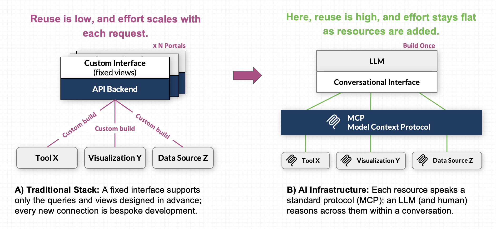
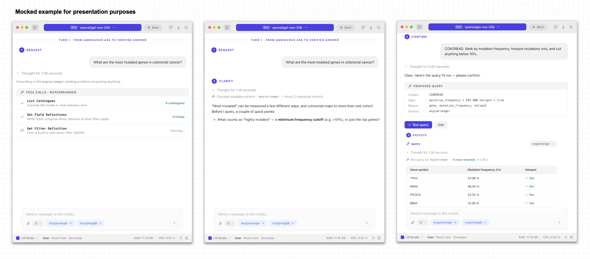
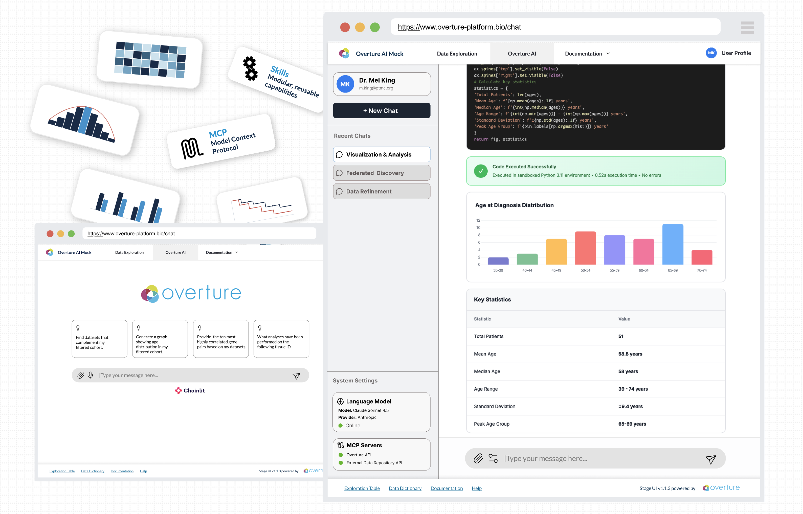

# AI-Assisted Data Discovery

AI-Assisted data discovery lets a researcher ask any deployed Overture portal questions in **plain language** and get back the exact records that answer them.

> _"show me all breast cancer samples with RNA-seq data from Canadian donors"_

The task is **natural language in, structured query out**, close in spirit to text-to-SQL, but the target is an Overture [Arranger](/develop/Arranger/overview) search query rather than SQL. This guide describes the workflow and the principles that govern it, walks you through a locally deployable testing environment, and gives reproducible use cases you can adapt to your own portal.

:::info Function first
This guide documents the _function_ (ask a question, review the generated query, get results) and the connection steps, so it holds regardless of which model host or chat client you use. Specific tools named below (LM Studio, MCP Inspector) are reference implementations, not requirements. A dedicated researcher-facing conversational host is in active development; today the capability is reachable through any MCP-compatible client pointed at the Arranger MCP server (see [Connect a host application](/use/ai-assisted-data-discovery/connect-a-host)).
:::

:::tip New to Overture search portals?
The [Building a Foundational Search Portal workshop](/use/workshop/prerequisites) walks you through standing up the base portal (Arranger and Stage) on your own tabular data. This guide picks up from there, extending that same platform with the Arranger MCP server so a language model can query it in plain language.
:::

## Why conversational discovery

Search APIs make data machine-accessible, but exposing them through MCP transforms how researchers interact with it. Rather than building custom, one-off integrations for every view or external dataset, MCP provides a standard protocol. A single conversational interface can query Overture data, synthesize results alongside other MCP-connected tools, and power end-to-end research workflows combining interactive data exploration, code execution, and dynamic visualization within one unified system.

## How a question becomes a query

A generated query is three parts, each mapping to part of the sentence:

| Part                                 | What it decides                          | From the example                            |
| ------------------------------------ | ---------------------------------------- | ------------------------------------------- |
| **SQON filter**                      | _which_ records to return                | "breast cancer … RNA-seq … Canadian donors" |
| **GraphQL field selection**          | _which fields_ to return for each record | "show me … samples"                         |
| **GraphQL aggregation** _(optional)_ | a summary, when the question implies one | "_how many_ … per province"                 |

[SQON](/develop/Arranger/reference/building-sqon-queries) is Overture's JSON filter language; the [GraphQL API](/develop/Arranger/reference/query-processing) carries the filter, field selection, and aggregation to Arranger, which translates them into an Elasticsearch query. Because the model must know a catalogue's real fields, types, and valid operators before it can build a valid query, it discovers them at runtime through Arranger's [Introspection API](/develop/Arranger/reference/introspection) rather than guessing. Because Arranger generates that schema live from the indexed data, the same MCP server works against any Overture deployment without changes.

## The researcher workflow

The workflow runs in four beats: **request, clarifying intent, confirm, execute.**

1. **Request.** The researcher asks a question in plain language. Before answering, the model grounds itself: it **lists the catalogues** to see which datasets exist, reads their descriptions to pick the relevant one, then **loads that catalogue's fields** (their types, descriptions, and valid operators) and the **SQON filter grammar** it needs to build a valid query. Loading fields for only the chosen catalogue, rather than every dataset up front, keeps the model within its context budget.
2. **Clarifying intent.** The model classifies the request as _answerable_, _ambiguous_, _unanswerable_, or _improper_, and responds accordingly: proposing a filter in plain language when it is answerable, presenting its interpretation and asking a targeted follow-up when it is ambiguous, or suggesting the closest available fields when the data cannot answer it. Because the fields come from live introspection, the model stays grounded in fields that actually exist rather than inventing them. (This classify-then-respond loop is adapted from Guo et al. (2024), [Enhancing LLMs for Multi-turn Text-to-SQL](https://arxiv.org/abs/2412.17867); the task here has the same shape, with an Arranger GraphQL query as the target instead of SQL.)
3. **Confirm.** The model presents the finished query in plain language for approval. Nothing runs until the researcher confirms (principle 2), a human-in-the-loop check enforced on every query.
4. **Execute.** Arranger runs the approved query and returns the matching records (or aggregation buckets).

## In this guide we will

1. **[Set up the testing environment](/use/ai-assisted-data-discovery/testing-environment)**: deploy the demo locally.
2. **[Connect a host application](/use/ai-assisted-data-discovery/connect-a-host)**: point LM Studio (or another MCP host) at the server.
3. **[Configuration templates](/use/ai-assisted-data-discovery/configuration-templates)**: server entry, recommended prompts, connection tests.
4. **[Demonstrated use cases](/use/ai-assisted-data-discovery/use-cases)**: reproducible conversational workflows.
5. **[Deploy the MCP server against your own Arranger](/use/ai-assisted-data-discovery/deploy-your-own-mcp-server)**: go beyond the demo.

## What's coming

Establishing accurate, precise retrieval within the conversational interface is the critical foundation for what comes next. Bringing data directly into the conversational flow moves us beyond traditional search and opens us up to entirely new horizons for AI-assisted reasoning, multi-tool integration, and interactive research.

- **A dedicated research environment** for interactive exploration, analysis, and visualization, where the model produces reproducible **code artifacts** (the data query, the analysis code, the visualization code) rather than opaque answers.
- **Extensibility** through additional MCP servers and reusable **Skills**, keeping research data under local context control.
- **Testing and model optimization**, including a benchmarked model recommendation after the August 2026 evaluation.

:::info Concept Art
These are early-stage exploratory concept mocks intended to illustrate potential design directions and functionality. They are not final representations of the user interface or system architecture.
:::

For the Arranger server's own roadmap, see its [AI and automation](/develop/Arranger/reference/ai-and-automation#whats-coming) reference.

:::info **Need Help?**
If you encounter any issues or have questions, please reach out through our [**community support channels**](https://docs.overture.bio/community/support).
:::
