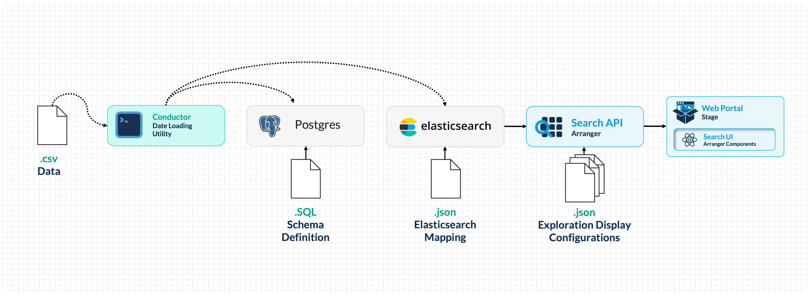
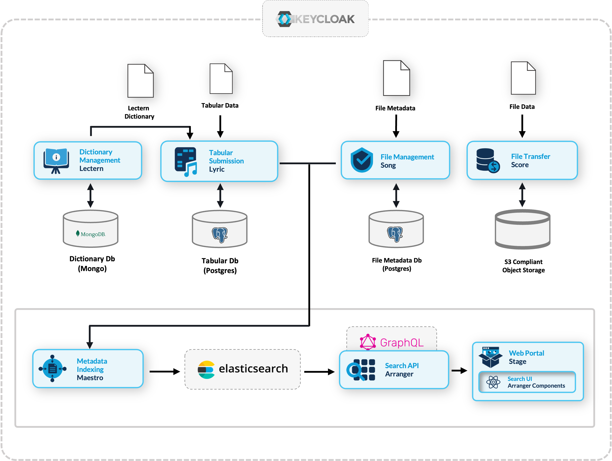
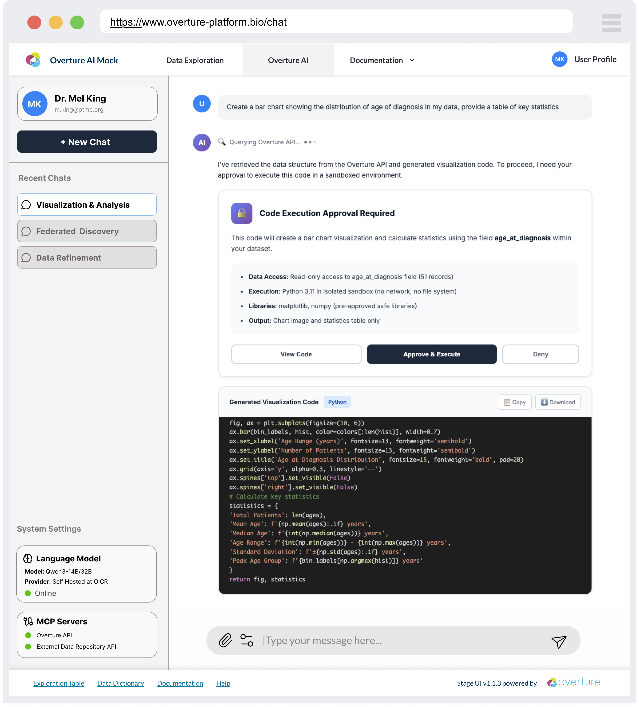

# Architecture

Now that you've seen the running portal, let's walk through how data flows from a CSV file to the search interface.



| Component                                                                                                  | Type                  | Description                                                                                                                                                    |
| ---------------------------------------------------------------------------------------------------------- | --------------------- | -------------------------------------------------------------------------------------------------------------------------------------------------------------- |
| **Conductor**                                                                                              | CLI tool              | Reads CSV files, loads records into PostgreSQL, then indexes them into Elasticsearch as structured documents.                                                  |
| **[PostgreSQL](https://www.postgresql.org/)**                                                              | Database              | Persistent relational storage for your data. Serves as the source of truth: data is loaded here first, then indexed into Elasticsearch for search.             |
| **[Elasticsearch](https://www.elastic.co/guide/en/elasticsearch/reference/7.17/elasticsearch-intro.html)** | Search engine         | Indexes and stores your data for search. Handles full-text search, faceted filtering, aggregations, and sorting.                                               |
| **[Arranger](https://docs.overture.bio/docs/core-software/arranger/overview)**                             | Search API + UI layer | Sits between Elasticsearch and the frontend. Provides a GraphQL API and generates search UI components (facets, tables, filters) based on configuration files. |
| **[Stage](https://docs.overture.bio/docs/core-software/stage/overview/)**                                  | Portal frontend       | A React-based web application that renders Arranger's search components and provides the overall portal experience (navigation, theming, documentation pages). |

### Data Flow

#### Setup Phase (one-time configuration)

Configuration files defining your PostgreSQL schema, Elasticsearch mappings, and Arranger settings are placed in `setup/configs/` and mounted into the Docker containers via volumes.

#### Runtime Phase (data loading and serving)

1. **Docker Compose** starts all services and runs initialization scripts:
   - PostgreSQL schemas are created
   - Elasticsearch index templates are applied
   - Indices are created from the templates

2. **Conductor** reads your CSV file and loads each row into PostgreSQL (persistent storage). It then reads from PostgreSQL, wraps each record in a structured JSON document (with a `data` object for your fields and a `submission_metadata` object for tracking), and bulk-indexes them into Elasticsearch.

3. **Arranger** connects to Elasticsearch, reads its configuration files, and exposes a GraphQL API. It also generates the search UI component definitions that Stage renders.

4. **Stage** renders the portal in the browser, fetching data through Arranger's API.

### Configuration Files

Understanding which configuration files exist and what they control is key to customizing the portal:

```plaintext
setup/configs/
├── elasticsearchConfigs/
│   └── datatable1-mapping.json    # Index mapping: field names, types, structure
├── arrangerConfigs/
│   └── datatable1/
│       ├── base.json              # Index name and document type
│       ├── extended.json          # Field display names
│       ├── table.json             # Table column visibility and sorting
│       └── facets.json            # Filter panel fields and ordering
└── postgresConfigs/
    └── datatable1.sql             # PostgreSQL table schema
```

#### How Configuration Connects to What You See

| Config File               | Controls                                   | Example Change                                                     |
| ------------------------- | ------------------------------------------ | ------------------------------------------------------------------ |
| `datatable1.sql`          | PostgreSQL table columns and types         | Change a column type, add constraints                              |
| `datatable1-mapping.json` | Which fields exist and their data types    | Change a field from `keyword` to `integer` to enable range filters |
| `base.json`               | Which Elasticsearch index Arranger queries | Point Arranger at a different index                                |
| `extended.json`           | Display names for fields in the UI         | Rename `age_at_diagnosis` to `Age at Diagnosis`                    |
| `table.json`              | Which columns appear in the data table     | Hide metadata columns, disable sorting on text fields              |
| `facets.json`             | Which filters appear in the sidebar        | Remove a filter, reorder the sidebar, hide a field                 |

### Docker Compose Services

The `docker-compose.yml` orchestrates all services. Each service is configured with environment variables, volume mounts, and health checks:

```plaintext
docker-compose.yml
├── setup          → Runs initialization scripts (index creation, health checks)
├── conductor-cli  → Loads CSV data into PostgreSQL and Elasticsearch
├── postgres       → Persistent storage (port 5435)
├── elasticsearch  → Search engine (port 9200)
├── arranger       → Search API (port 5050)
└── stage          → Portal frontend (port 3000 or 3001)
```

Services start in dependency order: PostgreSQL and Elasticsearch must be healthy before the setup scripts run; setup must complete before Arranger and Stage start; Conductor runs after setup to load data.

### The Overture Ecosystem

The components used in this workshop are part of the broader [Overture](https://overture.bio) open-source platform for research data management. The search and exploration stack we're using can be extended with additional services:



- **Lectern:** Data dictionary management (define and enforce data schemas)
- **Lyric:** Tabular data submission with validation
- **Song:** File metadata management
- **Score:** Object storage and file transfer
- **Maestro:** Event-driven indexing from Song/Lyric into Elasticsearch

These extensions are beyond the scope of this workshop but represent the natural next steps for teams that need structured data submission workflows, file management, or multi-service integration.

#### Conversational Data Discovery _(Active development 2026-2028)_

Structuring data through a search API like Arranger makes it **machine-accessible in a way that modern AI tooling can reason over**. Arranger exposes a live, structured description of your data, including field names, types, value distributions, and schema, making it a natural foundation for AI-assisted discovery. Our team is building a **[Conversational Data Discovery (CDD)](https://www.alliancecan.ca/en/latest/news/the-alliance-invests-in-transforming-research-software-to-accelerate-discovery)** platform that wraps self-hosted language models around Arranger-indexed datasets, allowing researchers to query and analyse data in plain language rather than constructing filters manually.

The platform connects to Arranger via the [Model Context Protocol (MCP)](https://modelcontextprotocol.io/) and is designed around four core principles: data minimisation by default, no action without explicit researcher consent, sandboxed code execution, and fully reproducible sessions. Because research data is often sensitive, the platform runs on sovereign infrastructure rather than routing queries through commercial AI providers.



:::info
**The interface shown above is a conceptual mock-up**. CDD is under active development and is not covered in this workshop.
:::

The infrastructure you are building today will be compatible when the CDD platform reaches production.

### Checkpoint

You should now be able to answer:

1. What does Conductor do? (Loads CSV rows into PostgreSQL, then indexes them into Elasticsearch)
2. What sits between Elasticsearch and the browser? (Arranger: provides GraphQL API and UI component config)
3. Where do configuration files live? (`setup/configs/`)

**Next:** Let's look at how to prepare your data for the portal.
