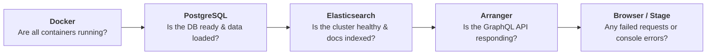

# Troubleshooting

The portal is a stack of connected services. When something goes wrong, the most effective approach is to identify which layer the problem is in and work from left to right.



Start at the left. If a container isn't running, nothing to the right of it will work.

### Step 1: Check Docker

Confirm all containers are up:

```bash
docker ps
```

You should see `stage`, `arranger-datatable1`, `elasticsearch`, and `postgres`. If any are missing, check their logs:

```bash
docker logs setup
docker logs postgres
docker logs elasticsearch
docker logs arranger-datatable1
docker logs stage
```

:::info
A container that exits immediately usually means a misconfiguration or a failed health check. The `setup` container logs are the most useful starting point as it runs the initialization sequence for the whole platform.
:::

### Step 2: Check Postgres

Confirm the database is accepting connections:

```bash
docker exec postgres pg_isready -U admin
```

Confirm your data was loaded:

```bash
docker exec postgres psql -U admin -d overtureDb -c "SELECT COUNT(*) FROM datatable1;"
```

If the table doesn't exist, the SQL schema wasn't applied, check `docker logs setup` for initialization errors.

### Step 3: Check Elasticsearch

Check cluster health:

```bash
curl -u elastic:myelasticpassword http://localhost:9200/_cluster/health?pretty
```

`status` should be `green` or `yellow`. Red means a shard is unassigned, which usually resolves on restart. Confirm documents are indexed:

```bash
curl -u elastic:myelasticpassword http://localhost:9200/datatable1_centric/_count?pretty
```

If the count is zero but PostgreSQL has records, run `./conductor index-db` to re-index:

```bash
./conductor index-db -t datatable1 -i datatable1-index
```

If the index doesn't exist at all, run `make restart` to recreate it from the mapping template.

### Step 4: Check Arranger

Confirm Arranger is responding:

```bash
curl -X POST http://localhost:5050/graphql \
  -H "Content-Type: application/json" \
  -d '{"query": "{ records { hits { total } } }"}'
```

:::info
`documentType` in `base.json` is always `"records"`, so the GraphQL query always uses `{ records { hits { total } } }`. If you see a `Cannot query field` error, it means `base.json` has the wrong value; verify that `"documentType": "records"` is set correctly.
:::

This should return a document count. If it fails, check `docker logs arranger-datatable1`. Common causes:

- Elasticsearch is not yet healthy when Arranger starts, run `make restart`
- `esIndex` in `base.json` doesn't match the alias in your Elasticsearch mapping

#### Data table or facets not rendering in Stage

If Arranger responds to the GraphQL query above but the data table or facet panel is blank or missing in the portal, the most common cause is a misconfigured field name. Check that field names in each file match the fields in your Elasticsearch mapping. Each config file also uses different notations and mixing them up is easy:

| Config file     | Field name format         | Example              |
| --------------- | ------------------------- | -------------------- |
| `facets.json`   | Double-underscore         | `data__field_name`   |
| `table.json`    | Dot notation (`jsonPath`) | `data.field_name`    |
| `extended.json` | Dot notation              | `data.field_name`    |
| `base.json`     | Alias name (`esIndex`)    | `datatable1_centric` |

Another common `table.json` issue is the `query` field, which must use the correct GraphQL traversal path (`hits`, `edges`, `nodes`) to reach the field value. An incorrect path here will cause columns to render empty even when data is present. See the [Arranger table configuration docs](https://docs.overture.bio/docs/core-software/Arranger/usage/arranger-components#table-configuration-tablejson) for the expected structure.

### Step 5: Check Stage and the Browser

If the portal loads but data is missing or filters aren't working, open your browser's developer tools:

- **Network tab** reload the page and look for failed requests (red). GraphQL requests to `/graphql` with error responses point to an Arranger problem (see above)
- **Console tab** JavaScript errors here are Stage-specific, usually a misconfigured environment variable

Check that Stage's environment variables point to the correct Arranger service and index:

```bash
docker logs stage 2>&1 | head -50
```

The most common Stage misconfiguration is `NEXT_PUBLIC_ARRANGER_DATATABLE_1_INDEX` not matching `ES_INDEX_0_ALIAS_NAME` in the setup service.

### Quick Reference

| Symptom                              | Likely layer    | First check                                        |
| ------------------------------------ | --------------- | -------------------------------------------------- |
| Container not in `docker ps`         | Docker          | `docker logs <container>`                          |
| Portal won't load at all             | Docker / Stage  | `docker ps`, `docker logs stage`                   |
| Portal loads, table is empty         | ES / Arranger   | ES document count, Arranger GraphQL query          |
| Data table or facets blank in portal | Arranger config | Validate all four config JSON files                |
| Facets or columns missing            | Arranger config | Check field notation in `facets.json`/`table.json` |
| Upload command fails                 | PostgreSQL      | `pg_isready`, check credentials match              |
| Data in PostgreSQL but not in portal | Elasticsearch   | `_count` query, run `./conductor index-db`         |
| Filters work but counts are wrong    | Elasticsearch   | Check alias name matches across all config files   |

**Still stuck?** Post in the [Overture support forum](https://github.com/overture-stack/roadmap/discussions/categories/support) with the output of `docker logs <container>` for the failing service. You can also reach the team directly at [contact@overture.bio](mailto:contact@overture.bio).
